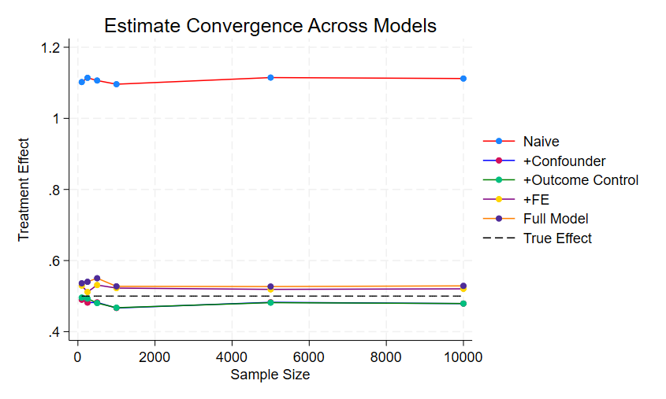
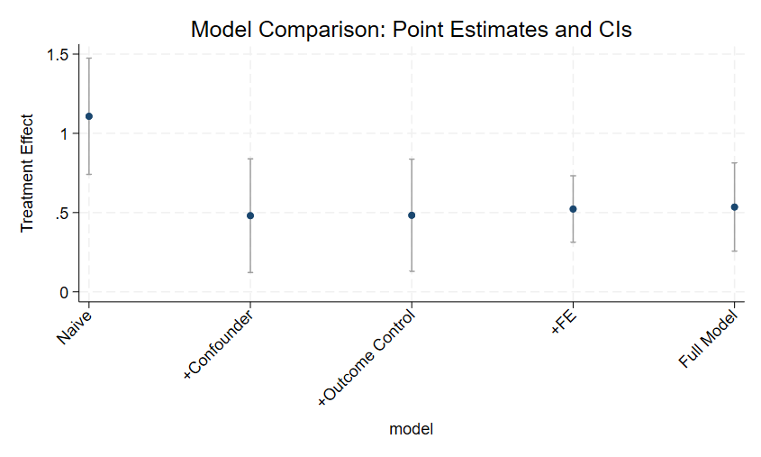

# Part 3: De-biasing a Parameter Estimate Using Controls

#### Estimate Convergence Across Models

This line chart tracks how treatment effect estimates from different regression models converge toward the true effect (dashed line at 0.5) as the sample size increases. Key observations:

##### Model Performance:

- Naive Model (no controls) shows significant upward bias, deviating furthest from the true effect.
- Adding confounders (+Confounder) reduces bias substantially.
- Including outcome-related controls (+Outcome Control) and fixed effects (+FE) further improves accuracy.
- The Full Model (all controls + FE) aligns closest to the true effect across all sample sizes.

##### Sample Size Impact:

- Larger samples reduce variance (lines tighten around true effect).
- Even at large samples (N=10,000), the Naive Model remains biased, highlighting the importance of control variables.

#### Model Comparison: Point Estimates and CIs

- Naive model (no controls) shows wide CIs and significant bias.
- Confounders narrows CIs and reduces bias.
- Including outcome-related controls (+Outcome Control) further refines precision.
- Full Model (FE + all controls) achieves both low bias and tight CIs.
- Including fixed effects (FE) and treatment-only predictors (Maine categories) improves precision.
- The Full Model’s CIs consistently contain the true effect, demonstrating robustness.

#### Regression Estimates by Model

| N      | Model             | b       | CI Low  | CI High  |
|--------|-------------------|---------|---------|----------|
| 100    | Naive             | 1.102   | 0.271   | 1.933    |
| 100    | +Confounder       | 0.490   | -0.323  | 1.303    |
| 100    | +Outcome Control  | 0.496   | -0.309  | 1.301    |
| 100    | +FE               | 0.530   | 0.047   | 1.012    |
| 100    | Full Model        | 0.536   | -0.112  | 1.184    |
| 250    | Naive             | 1.114   | 0.584   | 1.644    |
| 250    | +Confounder       | 0.482   | -0.038  | 1.001    |
| 250    | +Outcome Control  | 0.493   | -0.019  | 1.005    |
| 250    | +FE               | 0.512   | 0.210   | 0.813    |
| 250    | Full Model        | 0.540   | 0.143   | 0.937    |
| 500    | Naive             | 1.106   | 0.733   | 1.480    |
| 500    | +Confounder       | 0.482   | 0.117   | 0.847    |
| 500    | +Outcome Control  | 0.480   | 0.121   | 0.840    |
| 500    | +FE               | 0.531   | 0.319   | 0.743    |
| 500    | Full Model        | 0.550   | 0.271   | 0.830    |
| 1000   | Naive             | 1.096   | 0.831   | 1.361    |
| 1000   | +Confounder       | 0.467   | 0.209   | 0.724    |
| 1000   | +Outcome Control  | 0.467   | 0.214   | 0.721    |
| 1000   | +FE               | 0.523   | 0.373   | 0.672    |
| 1000   | Full Model        | 0.528   | 0.331   | 0.724    |
| 5000   | Naive             | 1.115   | 0.997   | 1.233    |
| 5000   | +Confounder       | 0.483   | 0.367   | 0.598    |
| 5000   | +Outcome Control  | 0.482   | 0.368   | 0.595    |
| 5000   | +FE               | 0.519   | 0.453   | 0.585    |
| 5000   | Full Model        | 0.527   | 0.439   | 0.614    |
| 10000  | Naive             | 1.112   | 1.029   | 1.196    |
| 10000  | +Confounder       | 0.479   | 0.398   | 0.560    |
| 10000  | +Outcome Control  | 0.479   | 0.399   | 0.559    |
| 10000  | +FE               | 0.521   | 0.474   | 0.567    |
| 10000  | Full Model        | 0.529   | 0.467   | 0.591    |
