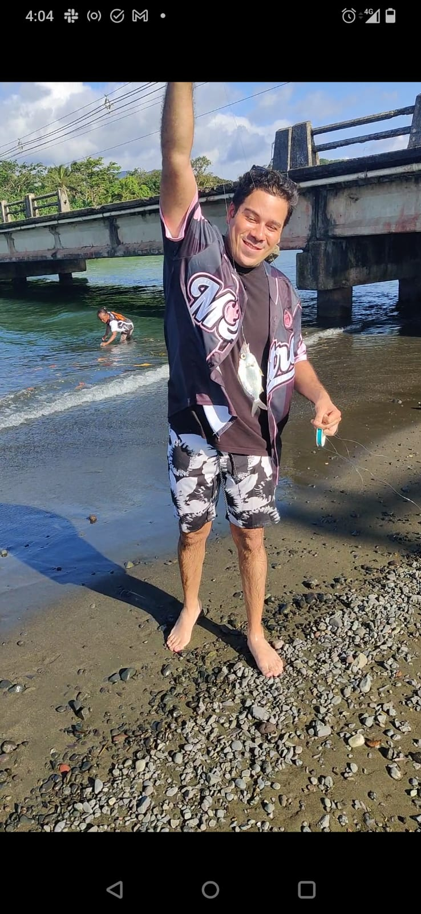

# Panamanian in Washington DC 📍
## A small bio from this panamanian adventure-seeker into the Policy Capital of the World

<!--  -->

**My beliefs**

* A strong sense of community is key to a healthy and collaborative society
* I strongly believe that education is the only way to society's success
* Knowing history is a tool way more powerful than technology in the present

**I love to...**

1. Wherever I travel or go either locally or abroad, I like to hike
2. I love to drink craft beers, I do have a ton of Google Maps saved placed for breweries
3. I love the beach, specially the Caribbean beaches, turquoise waters
4. I like to learn more about History

> Want to learn more about what I write about? Here is where I post most my thoughts about economic and political opinions. [Open Panama](https://sore-curve-b63.notion.site/Open-Panama-A-Call-for-Transparency-151a899d3e3580baaaa5cc965af45625)

**Why is History the Science of the present?**
> I strongly believe that no matter how much technology, algorithms we get our hands on, it will not be matched to understanding our History. I will give this example: indeed having social media platforms gives us an unmeasurable reach to the world. Nowadays the U.S. has a lied-founded narrative about the origins of the Panama Canal. These messages are spreading rapidly among republican and like-minded citizens in the globe. Nonetheless, the true History and facts about the Canal can be easily debunked using data and books. What History advocates have to do is to properly use the technology to outmatch the former lies. That's why History is very relevant nowadays in the misinformation era.